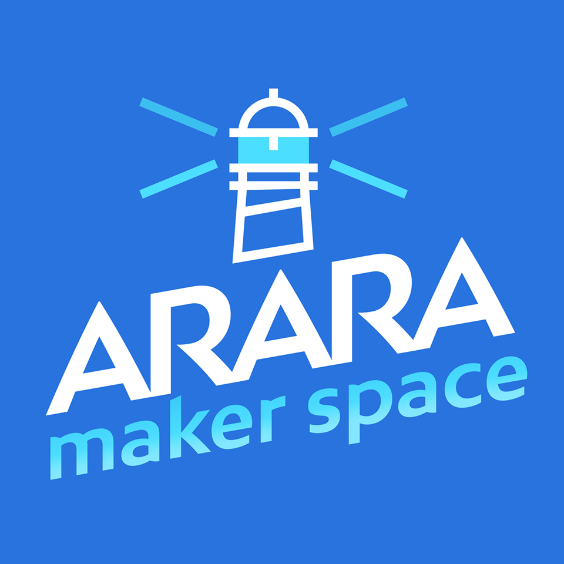

# Arara Makerspace UFSC 

## Universidade Federal de Santa Catarina

#### Professores do Makerspace

<h5>Matheus Francisco B. Machado</h5>

<h5>Gabriel Velho</h5>

<h5>Gabriel Medeiros Risadinha</h5>

<h5>Luan Rodrigues (yn)</h5>

<h5>Gabriel Domene</h5>

## O que é o Arara Makerspace?

O Espaço Maker, ou Makerspace, e um local onde pessoas se encontram para realizarem as suas diversas criação, estas pessoas são chamadas makers. O objetivo geral deste programa é implantar um espaço maker com estrutura para a criação de pequenos e grandes projetos, que seja disponı́vel para qualquer pessoa da comunidade.  Serão organizados cursos para a comunidade por meio da Escola de Extensão da UFSC e a verba arrecadada será destinada a aquisição de equipamentos para o makerspace. Os membros do programa participarão de eventos makers e editais de financiamento para desenvolver o espaço. Como resultado da disponibilizacção deste ambiente, espera-se um envolvimento maior dos estudantes com atividades oferecidas pela universidade, e maior interação da universidade com a comunidade em um ambiente colaborativo de projetos extraclasse, estimulando o desenvolvimento e inovação tecnológicas, além do desenvolvimento em membros da comunidade de competências relacinadas a  tecnologia e ao desenvolvimento de projetos, contribuindo para a o desenvolvimento social e tecnológico da região.

## Curso introdução ao Python

Este curso é uma introdução a linguagem de programação Python, com o objetivo de ensinar o básico de python para começarmos a fazer análise exploratória de dados.

## Descrição

Neste curso vamos mostrar porque devemos aprender python?
* Simplicidade  para aprender
* Pouco código para tarefas HARD

* Curva de aprendizagem 

> Por ser uma linguagem de programação simples, quem começa a programar em Python rapidamente estará desenvolvendo programas complexos e robustos!
	

Aprendendo o básico do Python, vc pode desenvolver:
>  Sistemas web Django, Flask, Pyramid...
>  Aplicações multiplataforma com Kivy 
>  Jogos com pygame
>  Interfaces gráficas com Tkinter ou PyQT

* Versatilidade 

> Python possui + de 130 mil lib https://pypi.python.org/pypi. 

* Multiplataforma

> Não é compilado e sim <b>INTERPRETADA</b>

> Uma linguagem interpretada é aquela na qual seu código-fonte é lido por um interpretador e convertido em código executável, o qual será executado por uma máquina virtual. Em Python, esse processo é dividido em 4 etapas:

> Análise Léxica: Quebra do código-fonte em tokens (strings com sentido identificado).

> Parsing: Processo de pegar esses tokens e gerar estruturas que mostram o relacionamento entre cada token (no caso do Python, essa estrutura é uma Abstract Syntax Tree - AST).

> Compilação: Transformação de uma AST em um ou mais Code Objects (“pedaços” de código executável). Interpretação: De posse dos Code Objects, o Interpretador então executa os códigos ali representados.

> Portanto, Python (que é uma linguagem interpretada) roda em diferentes plataformas, pois basta ter um interpretador para processar o código-fonte em qualquer sistema ou processador. Com Kivy, por exemplo, podemos empacotar nossa aplicação para Windows, Mac, Linux, iOS e Android!

* Comunidade <3

> Geralmente, ao iniciar o aprendizado de uma nova linguagem, nos deparamos com muitos obstáculos. 

> As vezes não entendemos a sintaxe.

> As vezes não entendemos a mensagem de erro.

> As vezes não conseguimos nem achar o erro.

> Quando isso acontece, temos algumas alternativas:

> Primeiro: fechar a IDE e ir jogar um Dota, um LoL, um WoW (mas você é mais forte que essa tentação! :wink: )

> Segundo: procurar na documentação/referência e tentar encontrar a solução do impasse por conta própria.

> Terceiro: procurar uma comunidade e torcer para que uma alma companheira lhe ajude.
No terceiro ponto, duas coisas podem acontecer:

> Sua dúvida ser acolhida e respondida; ou

> Sua dúvida cair no limbo das questões não resolvidas do StackOverflow

* Mercado

> Todas empregam Python em algum lugar de sua estrutura tecnológica!
 
> <a href="https://labs.spotify.com/2013/03/20/how-we-use-python-at-spotify/">Nesse artigo</a>, o pessoal do Spotify Labs explica onde Python está presente: serviços de backend e análise de dados!

> No site code.nasa.gov <a href="https://code.nasa.gov/">clique aqui</a>, você pode procurar por “python” e ver a quantidade de projetos que utilizam Python!

> Essa pesquisa <a href="https://spectrum.ieee.org/static/interactive-the-top-programming-languages-2017">clique aqui</a> mostra a popularidade das linguagens através da análise de dados do Github, API de pesquisas do Google, Google Trends, Twitter, Github, StackOverflow, Reddit entre outras fontes. Ela mostra que Python é a “linguagem mais popular” dentro de um universo de 48 linguagens (como Java, C, Objective-C, C#, etc), tendo atingido o topo em 2017!

## Estrutura do curso

### Módulo I
	* Aula do curso Introdução ao Python

### Códigos
	* Códigos desenvolvidos em aula

## Referências

https://pythonacademy.com.br/
https://pythonacademy.com.br/blog/porque-aprender-python-5-motivos-para-aprender-agora
http://blog.4linux.com.br/por-que-aprender-python/
https://www.hostgator.com.br/blog/10-motivos-para-voce-aprender-python/