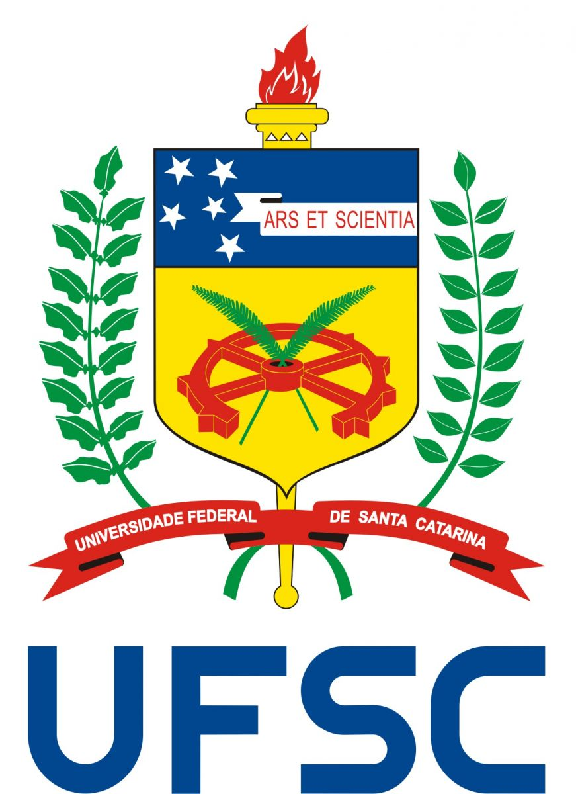

# Arara Makerspace UFSC 

## Universidade Federal de Santa Catarina

#### Professores do Makerspace

<h5>Matheus Francisco B. Machado</h5>

<h5>Gabriel Velho</h5>

<h5>Gabriel Medeiros Risadinha</h5>

<h5>Luan Rodrigues (yn)</h5>

<h5>Gabriel Domene</h5>

## O que é o Arara Makerspace?

O Espaço Maker, ou Makerspace, e um local onde pessoas se encontram para realizarem as suas diversas criação, estas pessoas são chamadas makers. O objetivo geral deste programa é implantar um espaço maker com estrutura para a criação de pequenos e grandes projetos, que seja disponı́vel para qualquer pessoa da comunidade.  Serão organizados cursos para a comunidade por meio da Escola de Extensão da UFSC e a verba arrecadada será destinada a aquisição de equipamentos para o makerspace. Os membros do programa participarão de eventos makers e editais de financiamento para desenvolver o espaço. Como resultado da disponibilizacção deste ambiente, espera-se um envolvimento maior dos estudantes com atividades oferecidas pela universidade, e maior interação da universidade com a comunidade em um ambiente colaborativo de projetos extraclasse, estimulando o desenvolvimento e inovação tecnológicas, além do desenvolvimento em membros da comunidade de competências relacinadas a  tecnologia e ao desenvolvimento de projetos, contribuindo para a o desenvolvimento social e tecnológico da região.

## Curso introdução ao Python

Este curso é uma introdução a linguagem de programação Python, com o objetivo de ensinar o básico de python para começarmos a fazer análise exploratória de dados.

